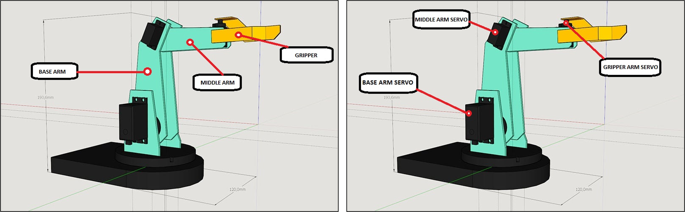
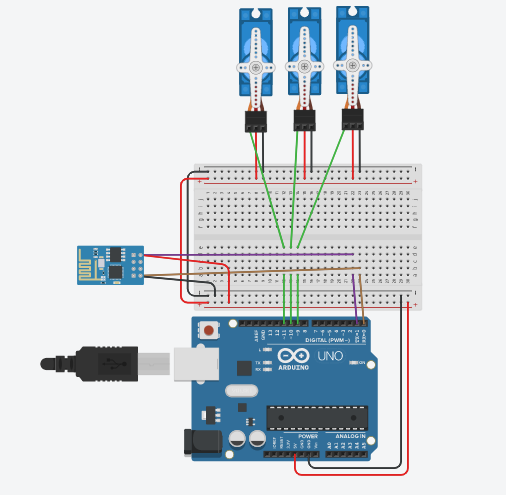
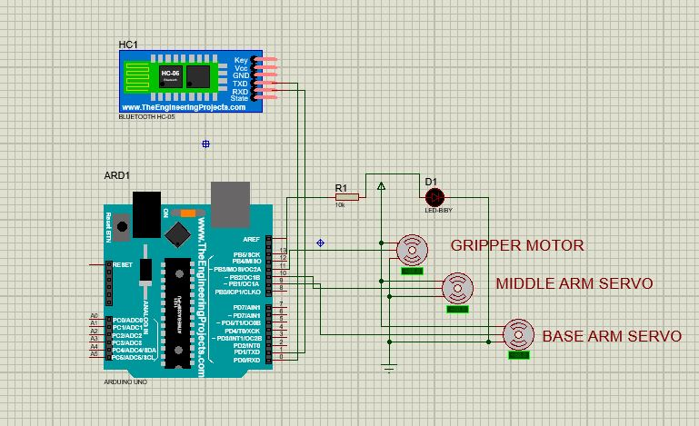
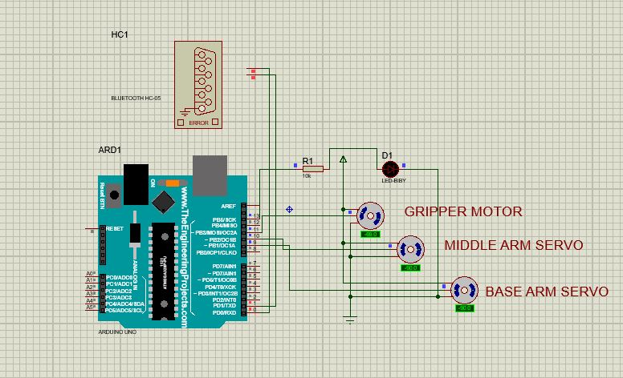
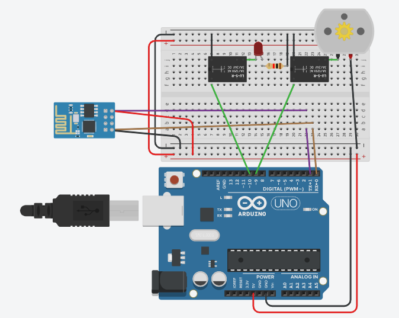
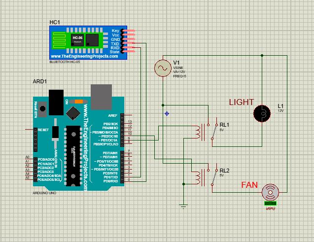
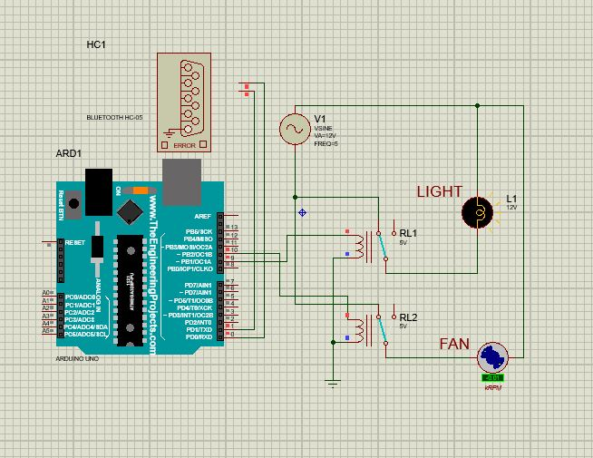
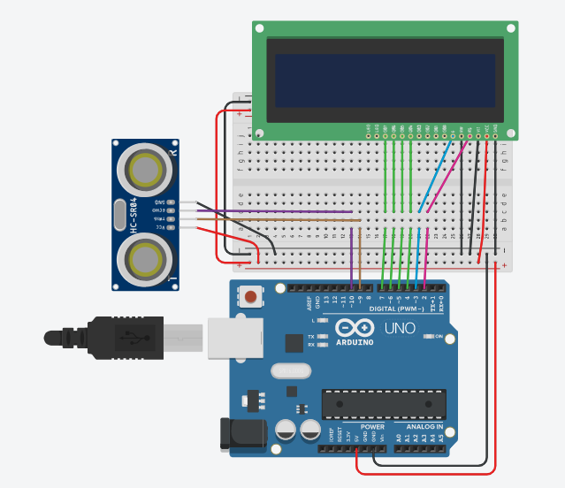

# arduino-proteus-projects
A collection of Arduino-based projects developed during my internship, including voice-controlled home automation systems and an ultrasonic distance meter with Proteus simulations.

## 📋 Index

1. [Android + Bluetooth + Arduino Pick and Place Robot](#project-1-android--bluetooth--arduino-pick-and-place-robot)
2. [Voice-Controlled Home Automation](#project-2-voice-controlled-home-automation)
3. [Ultrasonic Distance Meter Using Arduino](#project-3-ultrasonic-distance-meter-using-arduino)

## 📌 Project 1: Android + Bluetooth + Arduino Pick and Place Robot

### 📝 Description

This bot is controlled by an Android app which sends commands via Bluetooth. Servo motors control a three-axis robotic arm to perform pick-and-place operations.

The project simulates a basic robotic arm structure using servos. Though it is not industrial-grade, it is effective for practice and understanding robotic movement. Enhanced accuracy can be achieved with better servos, more precise control algorithms, and robust components.

### 🧩 Components

- [Arduino Uno](https://robu.in/product/arduino-uno-r3/)  
- [Bluetooth Module (HC-05)](https://robu.in/product/hc-05-6pin-bluetooth-module-with-button/)  
- [Servo Motors](https://robu.in/product/kst-servo-mr320/)  
- Breadboard  
- Jumper Wires  

### 🔌 Pin Diagram

| Arduino Pin | Connection            |
|-------------|------------------------|
| 9           | Base Arm Servo         |
| 10          | Middle Arm Servo       |
| 11          | Gripper Arm Servo      |
| RX          | TX (HC-05 Bluetooth)   |
| TX          | RX (HC-05 Bluetooth)   |

📷 **Pin Diagram Image:**  

### 💻 Simulation Output

  

### 📄 Detailed Report

For detailed circuit information, construction procedure, and analysis, refer to the full report:  
[📘 Project 1 Report (PDF)](docs/reports-pdf/Project_1.pdf)

## 💡 Project 2: Voice-Controlled Home Automation

### 📝 Description

Voice commands from an Android app are converted into strings and sent to the Arduino via Bluetooth. Based on the received command, the Arduino activates one of the connected relays to switch home devices (e.g., light and fan) ON or OFF.

This project uses 2 relays: one for a light and another for a fan. Communication is established via a Bluetooth module (HC-05), allowing the user to control devices using voice commands through their smartphone. The connection diagram and component simulation are shown in the Proteus outputs.

### 🧩 Components

- [Arduino Uno](https://robu.in/product/arduino-uno-r3/)  
- [Bluetooth Module (HC-05)](https://robu.in/product/hc-05-6pin-bluetooth-module-with-button/)  
- [Relay Module (2-channel)](https://robu.in/product/2-channel-relay-module-30a-5v-supports-high-and-low-trigger-optocoupler/)  
- Breadboard  
- Jumper Wires  

### 🔌 Pin Diagram

| Arduino Pin | Connection            |
|-------------|------------------------|
| 9           | Relay for Light        |
| 10          | Relay for Fan          |
| RX          | TX (HC-05 Bluetooth)   |
| TX          | RX (HC-05 Bluetooth)   |

📷 **Pin Diagram Image:**  

### 💻 Simulation Output

  

### 📄 Detailed Report

For full circuit diagrams, voice command structure, and working logic, refer to the project documentation:  
[📘 Project 2 Report (PDF)](docs/reports-pdf/Project_2.pdf)

## 📏 Project 3: Ultrasonic Distance Meter Using Arduino

### 📝 Description

This project uses the HC-SR04 ultrasonic sensor to measure the distance between two objects and displays the result on a 16x2 LCD. The sensor uses SONAR to detect objects, providing non-contact distance measurement from 2 cm to 400 cm with reliable accuracy.

### 🧩 Components

- [Arduino Uno](https://robu.in/product/arduino-uno-r3/)  
- [Ultrasonic Sensor (HC-SR04)](https://robu.in/product/hc-sr04-ultrasonic-range-finder/)  
- [LCD Display (16x2)](https://robu.in/product/16x2-character-y-b-lcd-display-module/)  
- Breadboard  
- Jumper Wires  

### 🔌 Pin Diagram

| Arduino Pin | Connection                 |
|-------------|-----------------------------|
| 2           | RS (LCD Display)            |
| 3           | E (LCD Display)             |
| 4           | D4 (LCD Display)            |
| 5           | D5 (LCD Display)            |
| 6           | D6 (LCD Display)            |
| 9           | Trigger (Ultrasonic Sensor) |
| 10          | Echo (Ultrasonic Sensor)    |

📷 **Pin Diagram Image:**  

### 💻 Simulation Output

  

### 📄 Detailed Report

For circuit design, LCD interfacing, and project explanation, refer to the full report:  
[📘 Project 3 Report (PDF)](docs/reports-pdf/Project_3.pdf)

## 🙏 Acknowledgments

- Special thanks to [Robotbanao - (A Brand Of Select)](https://www.linkedin.com/company/robotbanao) for guidance and resources during the project.
- Inspired by various Arduino and Proteus tutorials available in the open-source community.

---

## ©️ Copyright

© 2025 Sahil Rajpurkar. All rights reserved.  
Unauthorized commercial use or redistribution of content is prohibited without permission.